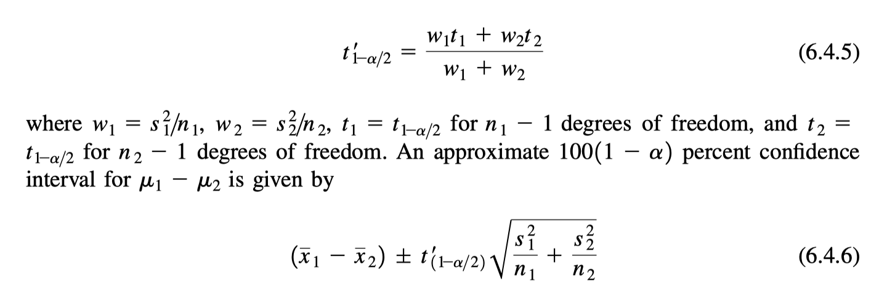
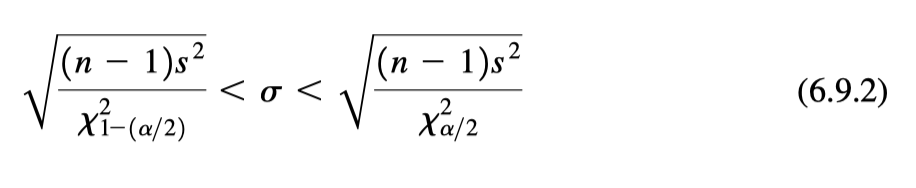
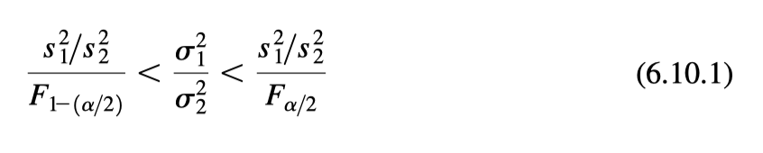

Estimación por Intervalo
========================

**INTERVALO DE CONFIANZA PARA UNA MEDIA POBLACIÓN**

Para ser más específicos, cuando el muestreo proviene de una distribución normal cuya desviación estándar, 
:math:`\sigma`, es desconocida, el intervalo de confianza del :math:`100(1 - \alpha)` por ciento para la 
media de la población, :math:`\mu`, 
está dado por

.. math::

   \bar{x} \pm t_{(1-\alpha/2} \frac{s}{\sqrt{n}}

**INTERVALO DE CONFIANZA PARA LA DIFERENCIA ENTRE DOS MEDIAS POBLACIONALES**

**Varianzas de población iguales**

.. image:: fig642.png

El número de grados de libertad utilizados para determinar el valor de ``t`` a utilizar en la construcción 
del 
intervalo es :math:`n_1+ n_2-2`, el denominador de la ecuación 6.4.2.

**Varianzas poblacionales no iguales**

**INTERVALO DE CONFIANZA PARA LA VARIANZA DE UNA POBLACIÓN NORMALMENTE DISTRIBUIDA**

Tenemos el siguiente intervalo de confianza del :math:`100(1-\alpha)` porciento para :math:`\sigma`, la 
desviación estándar de la población:

**INTERVALO DE CONFIANZA PARA LA RAZÓN DE LAS VARIANZAS DE DOS POBLACIONES NORMALMENTE DISTRIBUIDAS**

Tenemos el siguiente intervalo de confianza del :math:`100(1 - \alpha)` por ciento para 
:math:`\sigma_1^2/\sigma_2^2`.

