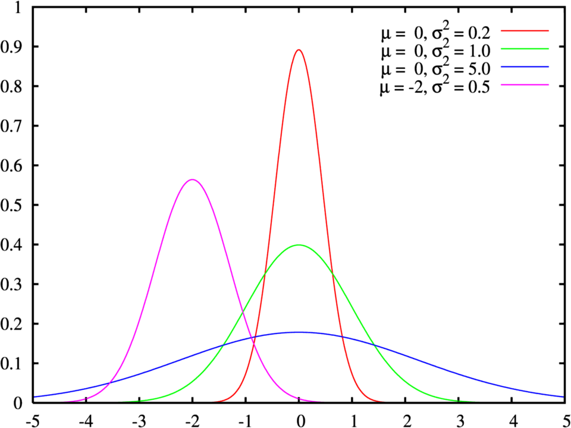
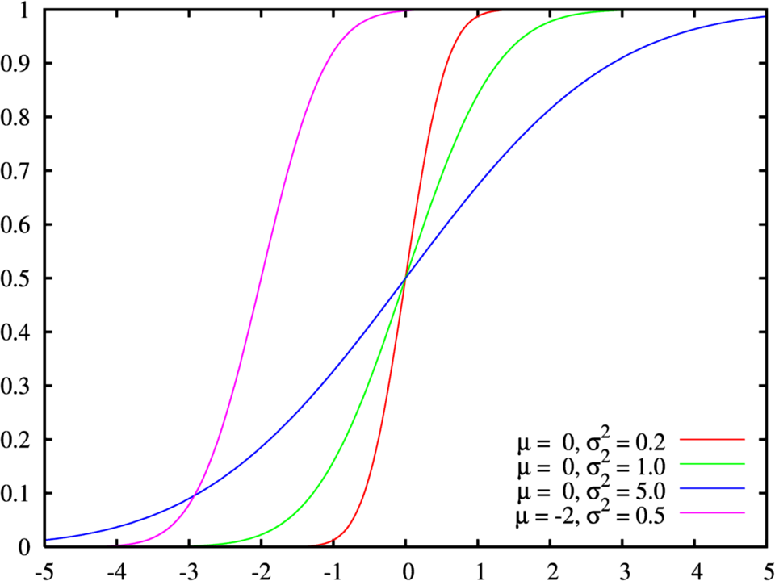

R como una Calculadora
======================

**Sistemas de Numeración**

.. math::

   \mathbb{N} = \{1,2,3,4,...\}

   \mathbb{Z} = \{... -3, -2, -1, 0, 1, 2, ,3, 4,...\}

   \mathbb{Q} = \{\frac{p}{q} | p, q \in  \mathbb{Z},\text{ con } q \neq 0 \}

   \mathbb{I} = \{ \pi, -2\pi, e, \sqrt{2}, ... \}

    \mathbb{R} =  \mathbb{Q} \cap \mathbb{I}   

**String's**, "cadenas de caracteres"

Ejemplos

1. "Hola" - longitud de 4 caracteres

2. 'Hola' 

3. 'Hola como estas'


Operadores Aritméticos: ``+, -, *, /, ^``

Operadores de Comparación: :math:`<, \leq, >, \geq, ==, !=`

Operadores Lógicos: ``&, |``

Algunas constantes en R: ``pi, Inf, NaN, NA, TRUE, FALSE``
 
**Algunas Funciones**

``getwd()`` - obten el directorio de trabajo

``setwd()`` - define el directorio de trabajo

``dir()`` - lista el directorio de trabajo

``mean()`` - calcula la media artimética 

``median()`` - calcula la mediana 
   
``sqrt()`` - encuentra la raíz cuadrada

``IQR()`` -  encuentra el rango intercuartil

``quantile()`` - encuentra los cuantiles

``log()`` - encuentra el logaritmo de base e
   
**Vectorees**

  Un vector es una secuencia de números dado como: :math:`{x_1, x_2, x_3, ..., x_n}`.
  En R se pueden definir vectores de la siguiente manera:


   ``c(5,4,3,55,77,77)`` se utiliza la función ``c()``

   ``3:10`` - ecuencia de números 3,4,5,6,7,8,9,10 con ``:``

   ``-5:4`` - secuencia de números -5, -4, -3, -2, -1, 0, 1, 2, 3, 4

   ``seq(0,1,.3)`` - secuencia de números con incrementos de .3 a partir de cero con la función ``seq()``

   ``rnorm(14, mean=55, sd=5)`` - genera 14 números aleatorios de una distribución normal con media de 55 y dessviación estándard de 5.

Otras maneras de generar vectores:

1. Dado el vector ``v=c(55, 60, 74, 33, 44, 55, 44, 33, 55, 33)``.

.. code:: R

   v[v>45] # vector cuyos elementos son mayores que 45
   v[v>40 & v<50]
   v[c(2,4,6)]  

Operaciones en y  entre Vectores:
--------------------------

Sea ``x <- 1:5, y <- c(2,1,2,3,2)```y ``z <- c(2,2,3,3,2``

.. code::

   x+y
   x/y
   x^y 
   x + 2*y - z
   log(x)
   mean(x)
   sqrt(x)
   IQR(x)

**Matrices**

Una matriz se define como:

.. math::

   \begin{pmatrix}
   x_{11} & x_{12} & ... & x_{1n}  \\
   x_{11} & x_{12} & ... & x_{1n}  \\
   \vdots & \vdots  & \ddots & \vdots  \\
   x_{m1} & x_{m2} & ... & x_{mn}  \\
   \end{pmatrix}

Es una matriz de tamaño :math:`m \times n`

Una matriz en R se define como:

.. code:: R

   matrix(1:6, ncol=2) # matriz de tamaño 3 x 2
   

**AYUDA en matrix**

.. code:: R

   matrix(data = NA, nrow = 1, ncol = 1, byrow = FALSE,
       dimnames = NULL)


Arguments

``data`` - an optional data vector (including a list or expression vector). Non-atomic classed R objects are coerced by 
as.vector and all attributes discarded.

``nrow`` - the desired number of rows.

``ncol`` - the desired number of columns.

``byrow`` - logical. If FALSE (the default) the matrix is filled by columns, otherwise the matrix is filled by rows.

``dimnames`` - A dimnames attribute for the matrix: NULL or a list of length 2 giving the row and column names respectively. 
An 
empty list is treated as NULL, and a list of length one as row names. The list can be named, and the list names will be used as names for the dimensions.


Otras Funciones
---------------

``rnorm(), qnorm(), dnorm(), pnorm()`` - distribución normal

.. math::

   \varphi_{\mu, \sigma^2}(x) = \frac{1}{\sigma \sqrt{2 \pi}} e^{-\frac{(x-\mu)^2}{2\sigma^2}}, x \in R

**Función de densidad de probabilidad**



**Función de distribución de probabilidad**



Graficación
-----------

Ejemplo 1.

.. code:: R

   x <- seq(-10,10, .1)
   y <- x^3 -2*x +1
   plot(x,y)


Ejemplo 2.

.. code:: R

   x <- 1:14 
