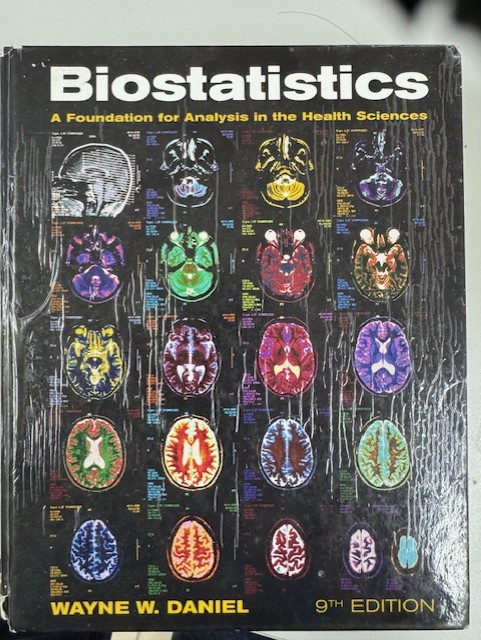
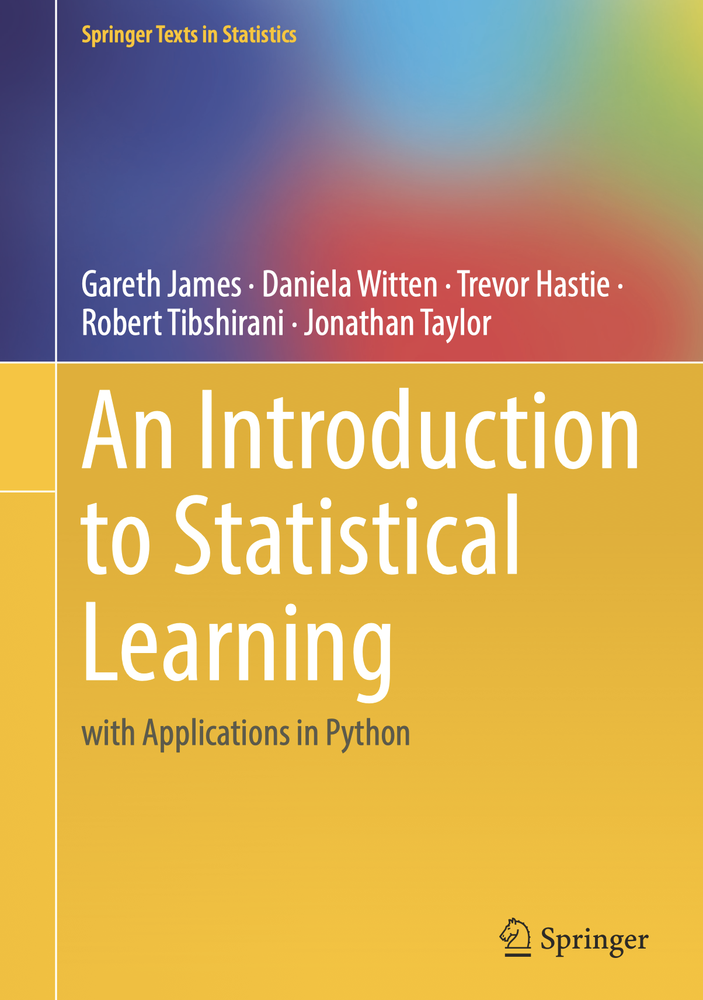
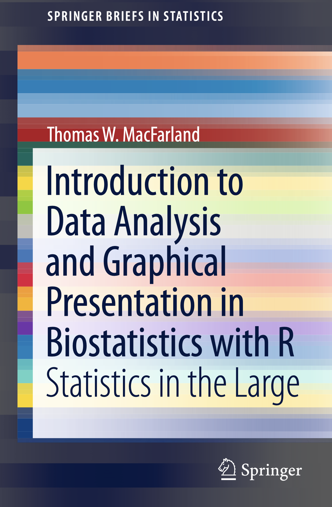
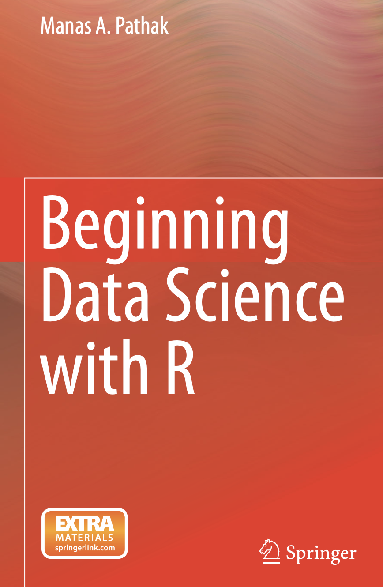

TEMARIO
=======

**Objetivos generales:**

- Introducir al alumno en aprender un lenguaje de programación para el análisis estadístico de datos.

**Objetivos específicos:**

- Aprender un lenguaje de programación, fácil de aprender y útil para el análisis de datos.

- Aprender herramientas que proporciona R para hacer análisis estadístico de datos, paramétrico y no paramétrico.

Horario
-------

Se impartira del 9 al 20 de junio, de lunes a viernes de 14:00 a 17:00 horas.

Temas
-----

1. Qué es “R”. Instalación y Ambiente de Programación. Historia

2. R como Calculadora. Operadores Aritméticos, Operadores de Comparación.

3. Conceptos básicos de Programación Orientada a Objetos. Tipos de Datos. Datos Escalares, Vectores, Factores, Matrices. Definición de  Variables.

4. Solución de Ecuaciones. Diferenciación e Integración de Funciones.

5. Script’s. Implementando algoritmos en la solución de problemas con el lenguaje de programación “R”.

6. Estructuras de Control: if, while, for

7. Funciones en R. “apply”, Paquetes. Ayuda!.

8. Graficación. ggplot

9. Otras estructuras de datos. Arreglos, Listas y DataFrame’s

10. Entrada Y Salida. Salvando y restaurando datos de R.

11. Funciones de Usuario y Programación.

12. Aplicaciones

12.1 Diferenciación, Integración e Interpolación.

12.2 Solución de ecuaciones y sistemas de ecuaciones lineales.

12.3 Solución de Sistemas de Ecuaciones Diferenciales de 1er orden acopladas.

12.4 Algebra Lineal Basica. Operaciones Aritméticas. Valores Propios, Vectores Propios y Determinantes.

12.5 Distribuciones de Probabilidad. Discretas y Continuas

12.6 Estadística Descriptiva

12.7 Regresión Lineal y Correlación.

12.8 Análisis de Componentes Principales

12.9 Análisis de Agrupamiento (“Clustering”)

12.10 Regresion Lineal Multiple. Correlación Canónica.

12.11 Análisis de Imágenes

Software Utilizado
------------------

`REF-01 <https://www.r-project.org/>`_

`REF-02 <https://posit.co/download/rstudio-desktop/>`_

Bibliografía Básica:
--------------------

1. Daniel, Wayne, "Biostatistics. A Foundation for Analysis in the Heath Sciences", 9Edition, WILEY.

2. Gareth James and Daniela Witten, “An Introduction to Satistical Learning”, Ed. Springer

3. Thomas W. MacFarland, “Introduction to Data Analysis and Graphical Presentation in Biostatistics with R”. Ed. 
Springer

4. Manas A. Pathak, “Beginning Data Science with R”. Ed. Springer

