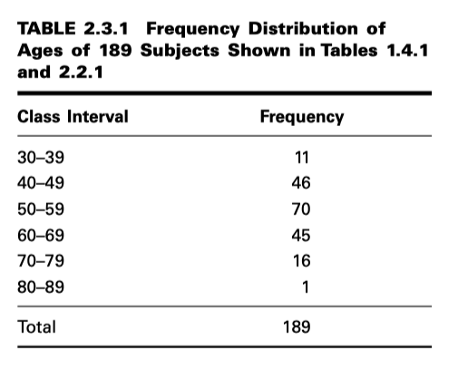
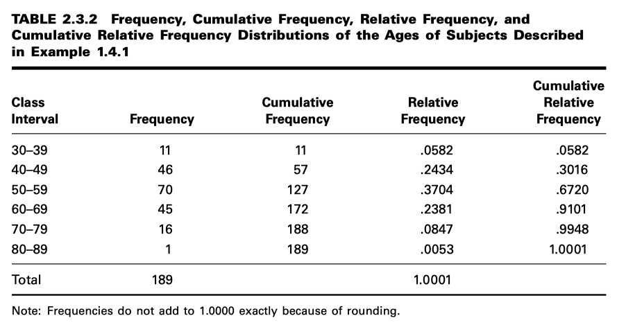
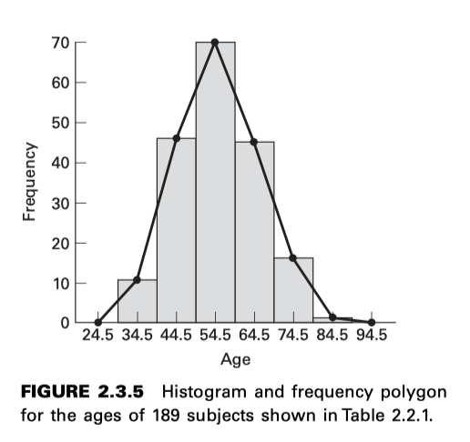

Estadística
===========

Con frecuencia recordamos que vivimos en la era de la información.

Los objetivos de este libro son dos: (1) enseñar al estudiante a organizar y resumir datos, y (2) enseñarle a tomar 
decisiones sobre un gran volumen de datos examinando solo una pequeña parte.

**1. Algunos conceptos básicos**

``Variable``. Si, al observar una característica, observamos que adquiere valores diferentes en distintas personas, 
lugares o cosas, la denominamos variable.

``Variables cuantitativas``

``Variables cualitativas``

``Variable aleatoria``

``Variable aleatoria discreta``

``Variable aleatoria continua``

``Población``. La persona promedio considera una población como un conjunto de entidades, generalmente personas. Sin 
embargo, una población o conjunto de entidades puede consistir en animales, máquinas, lugares o células. Para 
nuestros propósitos, definimos una población de entidades como el conjunto más grande de entidades que nos interesan 
en un momento dado. Si medimos una variable en cada una de las entidades de una población, generamos una población de 
valores de esa variable. Por lo tanto, podemos definir una población de valores como el conjunto más grande de 
valores de una variable aleatoria que nos interesa en un momento dado. Si, por ejemplo, nos interesan los pesos de 
todos los niños matriculados en un sistema escolar primario de un condado determinado, nuestra población consta de 
todos estos pesos. Si nuestro interés se centra únicamente en los pesos de los alumnos de primer grado del sistema, 
tenemos una población diferente: los pesos de los alumnos de primer grado matriculados en el sistema escolar. Por lo 
tanto, las poblaciones están determinadas o definidas por nuestro ámbito de interés. Las poblaciones pueden ser 
finitas o infinitas. Si una población de valores consta de un número fijo de estos valores, se dice que la población 
es finita. Si, por el contrario, una población consiste en una sucesión infinita de valores, la población es 
infinita.			

``Muestra``. Una muestra puede definirse simplemente como una parte de una población. Supongamos que nuestra 
población 
está compuesta por los pesos de todos los niños de primaria matriculados en un sistema escolar del condado. Si 
recopilamos para el análisis los pesos de solo una fracción de estos niños, solo tenemos una parte de nuestra 
población de pesos; es decir, tenemos una muestra.

**ESCALAS DE MEDICION**

La escala nominal. La escala de medición más baja es la escala nominal. Como su nombre lo indica, consiste en nombrar 
las observaciones o clasificarlas en diversas categorías mutuamente excluyentes y colectivamente exhaustivas. La 
práctica de usar números para distinguir entre los diversos diagnósticos médicos constituye una medición en una 
escala nominal. Otros ejemplos incluyen dicotomías como hombre-mujer, sano-enfermo, menor de 65 años-mayor de 65 
años, niño-adulto, y casado-soltero.	

La escala ordinal. Siempre que las observaciones no solo difieren entre categorías, sino que también pueden 
clasificarse según algún criterio, se dice que se miden en una escala ordinal. Los pacientes convalecientes pueden 
clasificarse como no mejorados, mejorados o muy mejorados. Los individuos pueden clasificarse según su nivel 
socioeconómico como bajo, medio o alto. La inteligencia de los niños puede ser superior al promedio, promedio o 
inferior al promedio. En cada uno de estos ejemplos, los miembros de cualquier categoría se consideran iguales, pero 
los miembros de una categoría se consideran inferiores, peores o más pequeños que los de otra categoría, que a su vez 
guarda una relación similar con otra categoría.

La escala de intervalo La escala de intervalo es una escala más sofisticada que la nominal u ordinal en que con esta 
escala no solo es posible ordenar mediciones, sino que también se conoce la distancia entre dos mediciones 
cualesquiera. Sabemos, digamos, que la diferencia entre una medición de 20 y una medición de 30 es igual a la 
diferencia entre mediciones de 30 y 40. La capacidad de hacer esto implica el uso de una unidad de distancia y un 
punto cero, ambos arbitrarios. El punto cero seleccionado no es necesariamente un cero verdadero en el sentido de que 
no tiene que indicar una ausencia total de la cantidad que se está midiendo. Quizás el mejor ejemplo de una escala de 
intervalo lo proporciona la forma en que generalmente se mide la temperatura (grados Fahrenheit o Celsius). La unidad 
de medida es el grado, y el punto de comparación es el “cero grados” elegido arbitrariamente, que no indica falta de 
calor. La escala de intervalo, a diferencia de las escalas nominal y ordinal, es una escala verdaderamente 
cuantitativa.

La escala de razón. El nivel más alto de medición es la escala de razón. Esta escala se caracteriza por permitir 
determinar la igualdad de razones, así como la igualdad de intervalos. Un punto cero verdadero es fundamental para la 
escala de razón. La medición de características tan comunes como la altura, el peso y la longitud utiliza la escala 
de razón.

**MUESTREO e INFERENCIA ESTADÍSTICA**

La inferencia estadística es el procedimiento mediante el cual llegamos a una conclusión sobre una población sobre la 
base de la información contenida en una muestra extraída de esa población.

Si se extrae una muestra de tamaño n de una población de tamaño N de tal manera que cada muestra posible de tamaño n 
tiene la misma probabilidad de ser seleccionada, la muestra se denomina muestra aleatoria simple.

.. code:: R

   datos <- read.csv('EXA_C01_S04_01.csv', header=T)

   attach(datos)

   print(summary(AGE))

   ss = sample(AGE, 12)

   print(ss)

**ESTADISTICA DESCRIPTIVA**

``mean()``
``median()``
``var()``
``sd()``
``IQR()``
``range()``
``sort()``
``hist``
``barplot()``
``boxplot()``

Ejercicio. En base al ejercicio anterior generar las siguientes tablas y graficos.

.. image:: t3.png

